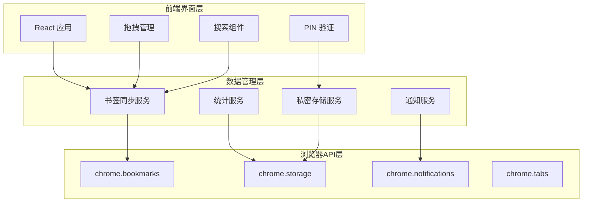
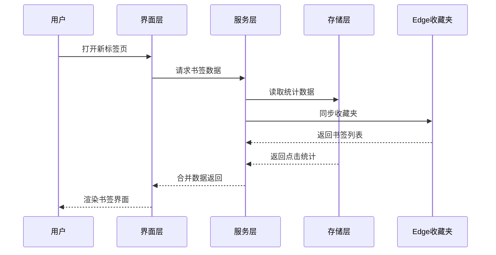

# FavouriteEdge 书签管理器 - 实施方案与开发计划

## 项目概述

**项目名称**：FavouriteEdge 书签管理器  
**项目类型**：Microsoft Edge 浏览器扩展  
**开发周期**：90小时（约11个工作日）  
**技术栈**：JavaScript ES6+, React 18, Chrome Extension APIs  
**目标用户**：个人用户（单机版）  

---

## 1. 项目目标与成功标准

### 核心目标
- 替换 Edge 默认新标签页为功能丰富的书签管理器
- 提供直观的拖拽式书签管理体验
- 实现 PIN 保护的私密书签功能
- 统计使用频率并智能排序展示
- 与 Edge 原生收藏夹完全同步

### 成功标准
- [ ] 支持500+书签流畅管理
- [ ] 拖拽操作响应时间 < 100ms
- [ ] 新标签页加载时间 < 500ms
- [ ] PIN 验证安全机制稳定运行
- [ ] 零数据丢失，完美同步

---

## 2. 项目架构设计

### 2.1 技术架构图



### 2.2 数据流设计



---

## 3. 开发计划详细安排

### Phase 1: 项目基础搭建 (第1-2天，20小时)

#### Day 1 (8小时)
**上午 (4小时)**
- [x] 项目初始化和环境配置
- [x] 创建基础文件结构
- [x] 配置 Webpack 构建流程
- [x] 设置 ESLint 和 Prettier

**下午 (4小时)**
- [x] 实现 manifest.json 配置
- [x] 创建基础 React 应用框架
- [x] 搭建开发服务器和热重载
- [x] 实现基础的 Chrome API 封装

#### Day 2 (8小时)
**上午 (4小时)**
- [x] 实现书签数据获取服务
- [x] 创建基础组件结构
- [x] 实现数据状态管理 (Zustand)
- [x] 书签列表基础渲染

**下午 (4小时)**
- [x] 实现与 Edge 收藏夹的双向同步
- [x] 添加错误处理和日志系统
- [x] 完成第一阶段单元测试
- [x] 代码审查和重构

**输出物**：
- ✅ 可运行的基础扩展框架
- ✅ 基础书签数据同步功能
- ✅ 开发环境和构建流程

---

### Phase 2: 界面开发 (第3-5天，25小时)

#### Day 3 (8小时)
**上午 (4小时)**
- [ ] 实现 1920×1080 响应式布局
- [ ] 创建书签网格组件
- [ ] 实现书签图标和标题显示
- [ ] 添加分组标签栏

**下午 (4小时)**
- [ ] 集成 react-dnd 拖拽库
- [ ] 实现书签拖拽基础功能
- [ ] 添加拖拽视觉反馈效果
- [ ] 实现分组间拖拽

#### Day 4 (8小时)
**上午 (4小时)**
- [ ] 实现搜索功能界面
- [ ] 添加实时搜索过滤
- [ ] 实现搜索结果高亮
- [ ] 添加搜索历史功能

**下午 (4小时)**
- [ ] 实现最常访问区域布局
- [ ] 添加手动排序区域
- [ ] 实现书签位置拖拽调整
- [ ] 优化拖拽操作用户体验

#### Day 5 (9小时)
**上午 (4小时)**
- [ ] 完善界面细节和动画效果
- [ ] 添加操作确认对话框
- [ ] 实现右键菜单功能
- [ ] 添加键盘快捷键支持

**下午 (5小时)**
- [ ] 界面响应性优化
- [ ] 跨浏览器兼容性测试
- [ ] 界面可用性测试
- [ ] 用户体验优化调整

**输出物**：
- ✅ 完整的用户界面
- ✅ 流畅的拖拽交互
- ✅ 实时搜索功能
- ✅ 响应式布局适配

---

### Phase 3: 核心功能开发 (第6-7天，20小时)

#### Day 6 (10小时)
**上午 (5小时)**
- [ ] 实现私密文件夹数据结构
- [ ] 创建 PIN 码验证组件
- [ ] 实现私密书签独立存储
- [ ] 添加 PIN 码安全机制

**下午 (5小时)**
- [ ] 实现点击统计跟踪系统
- [ ] 创建统计数据存储结构
- [ ] 实现访问频率计算算法
- [ ] 添加智能排序功能

#### Day 7 (10小时)
**上午 (5小时)**
- [ ] 实现回收站文件夹创建
- [ ] 添加书签删除到回收站功能
- [ ] 实现回收站书签恢复
- [ ] 添加回收站管理界面

**下午 (5小时)**
- [ ] 完善数据持久化机制
- [ ] 添加数据迁移和升级
- [ ] 实现配置项管理
- [ ] 核心功能集成测试

**输出物**：
- ✅ PIN 保护的私密书签
- ✅ 智能统计排序系统
- ✅ 完整的回收站机制
- ✅ 稳定的数据存储

---

### Phase 4: 通知与集成 (第8-9天，15小时)

#### Day 8 (8小时)
**上午 (4小时)**
- [ ] 实现后台脚本监听
- [ ] 添加新书签创建监听
- [ ] 实现通知消息推送
- [ ] 添加通知交互处理

**下午 (4小时)**
- [ ] 实现新书签高亮显示
- [ ] 添加书签同步状态指示
- [ ] 完善错误处理机制
- [ ] 添加离线状态支持

#### Day 9 (7小时)
**上午 (4小时)**
- [ ] 优化数据同步性能
- [ ] 添加批量操作优化
- [ ] 实现内存使用优化
- [ ] 完善日志和调试信息

**下午 (3小时)**
- [ ] 集成测试所有功能模块
- [ ] 修复发现的集成问题
- [ ] 性能基准测试
- [ ] 代码质量检查

**输出物**：
- ✅ 完整的通知系统
- ✅ 稳定的后台同步
- ✅ 优化的性能表现
- ✅ 健壮的错误处理

---

### Phase 5: 测试与发布 (第10-11天，10小时)

#### Day 10 (6小时)
**上午 (3小时)**
- [ ] 功能完整性测试
- [ ] 边界条件测试
- [ ] 性能压力测试 (500+ 书签)
- [ ] 安全性测试

**下午 (3小时)**
- [ ] 用户场景测试
- [ ] 兼容性测试
- [ ] 回归测试
- [ ] 问题修复和优化

#### Day 11 (4小时)
**上午 (2小时)**
- [ ] 打包和构建优化
- [ ] 生成发布包
- [ ] 编写用户手册
- [ ] 安装测试验证

**下午 (2小时)**
- [ ] 最终验收测试
- [ ] 项目文档整理
- [ ] 代码注释完善
- [ ] 项目交付准备

**输出物**：
- ✅ 可发布的扩展包
- ✅ 完整的测试报告
- ✅ 用户使用手册
- ✅ 技术文档

---

## 4. 项目文件结构

```
FavouriteEdge/
├── src/
│   ├── components/           # React 组件
│   │   ├── BookmarkGrid/     # 书签网格组件
│   │   ├── SearchBar/        # 搜索栏组件
│   │   ├── PrivateFolder/    # 私密文件夹组件
│   │   ├── RecycleBin/       # 回收站组件
│   │   └── Common/           # 通用组件
│   ├── services/             # 业务逻辑服务
│   │   ├── bookmarkService.js    # 书签管理服务
│   │   ├── statisticsService.js  # 统计服务
│   │   ├── privateService.js     # 私密存储服务
│   │   └── notificationService.js # 通知服务
│   ├── store/                # 状态管理
│   │   ├── bookmarkStore.js  # 书签状态
│   │   ├── uiStore.js        # 界面状态
│   │   └── privateStore.js   # 私密数据状态
│   ├── utils/                # 工具函数
│   │   ├── chromeApi.js      # Chrome API 封装
│   │   ├── dragHelper.js     # 拖拽辅助函数
│   │   └── validator.js      # 数据验证
│   ├── styles/               # 样式文件
│   │   ├── global.css        # 全局样式
│   │   ├── components/       # 组件样式
│   │   └── themes/           # 主题配置
│   ├── background/           # 后台脚本
│   │   ├── background.js     # 主后台脚本
│   │   ├── bookmarkListener.js # 书签监听器
│   │   └── notificationHandler.js # 通知处理
│   ├── popup/                # 弹窗页面（可选）
│   │   ├── popup.html
│   │   ├── popup.js
│   │   └── popup.css
│   └── content/              # 内容脚本（如需要）
├── public/
│   ├── manifest.json         # 扩展配置文件
│   ├── icons/                # 图标资源
│   ├── index.html            # 新标签页模板
│   └── _locales/             # 国际化文件
├── tests/                    # 测试文件
│   ├── unit/                 # 单元测试
│   ├── integration/          # 集成测试
│   └── e2e/                  # 端到端测试
├── docs/                     # 项目文档
│   ├── api.md                # API 文档
│   ├── user-manual.md        # 用户手册
│   └── dev-guide.md          # 开发指南
├── tools/                    # 构建工具
│   ├── webpack.config.js     # Webpack 配置
│   ├── build.js              # 构建脚本
│   └── dev-server.js         # 开发服务器
├── .eslintrc.js              # ESLint 配置
├── .prettierrc               # Prettier 配置
├── package.json              # 项目依赖
└── README.md                 # 项目说明
```

---

## 5. 技术规范与编码标准

### 5.1 JavaScript 编码规范

```javascript
// 使用 ES6+ 语法
// 函数命名：驼峰命名法
// 类命名：帕斯卡命名法
// 常量：大写下划线

// 示例：服务类定义
class BookmarkService {
  constructor() {
    this.API_BASE = chrome.bookmarks;
    this.STORAGE_KEY = 'privateedge_data';
  }
  
  async getBookmarks() {
    try {
      const bookmarks = await this.API_BASE.getTree();
      return this.transformBookmarkData(bookmarks);
    } catch (error) {
      console.error('获取书签失败:', error);
      throw new Error('BOOKMARK_FETCH_ERROR');
    }
  }
}
```

### 5.2 React 组件规范

```jsx
// 功能组件 + Hooks
// PropTypes 类型检查
// 默认导出组件

import React, { useState, useEffect } from 'react';
import PropTypes from 'prop-types';
import './BookmarkItem.css';

const BookmarkItem = ({ bookmark, onDragStart, onDoubleClick }) => {
  const [isHovered, setIsHovered] = useState(false);
  
  useEffect(() => {
    // 组件挂载逻辑
  }, []);
  
  return (
    <div 
      className={`bookmark-item ${isHovered ? 'hovered' : ''}`}
      onMouseEnter={() => setIsHovered(true)}
      onMouseLeave={() => setIsHovered(false)}
    >
      {/* 组件内容 */}
    </div>
  );
};

BookmarkItem.propTypes = {
  bookmark: PropTypes.object.isRequired,
  onDragStart: PropTypes.func.isRequired,
  onDoubleClick: PropTypes.func
};

export default BookmarkItem;
```

### 5.3 CSS 样式规范

```css
/* BEM 命名方法 */
/* 组件作用域样式 */
/* CSS 变量定义 */

:root {
  --primary-color: #0078d4;
  --secondary-color: #f3f2f1;
  --text-color: #323130;
  --border-radius: 4px;
  --shadow: 0 2px 8px rgba(0,0,0,0.1);
}

.bookmark-grid {
  display: grid;
  grid-template-columns: repeat(10, 1fr);
  gap: 8px;
  padding: 16px;
}

.bookmark-grid__item {
  width: 80px;
  height: 80px;
  border-radius: var(--border-radius);
  transition: transform 0.2s ease;
}

.bookmark-grid__item--dragging {
  transform: scale(1.05);
  box-shadow: var(--shadow);
}
```

---

## 6. 测试策略

### 6.1 单元测试覆盖

| 模块 | 测试重点 | 覆盖率目标 |
|------|----------|------------|
| 书签服务 | CRUD 操作、数据同步 | 90% |
| 统计服务 | 点击统计、排序算法 | 85% |
| 私密服务 | PIN验证、数据加密 | 95% |
| 拖拽功能 | 拖拽逻辑、位置计算 | 80% |
| 搜索功能 | 搜索算法、过滤逻辑 | 85% |

### 6.2 集成测试场景

```javascript
// 测试示例：完整用户流程
describe('用户书签管理流程', () => {
  test('新用户首次使用', async () => {
    // 1. 加载新标签页
    // 2. 同步 Edge 收藏夹
    // 3. 显示书签网格
    // 4. 验证界面元素
  });
  
  test('添加新书签到私密文件夹', async () => {
    // 1. 点击私密文件夹
    // 2. 输入PIN码
    // 3. 添加新书签
    // 4. 验证存储成功
  });
});
```

### 6.3 性能测试基准

| 指标 | 目标值 | 测试方法 |
|------|--------|----------|
| 新标签页加载时间 | < 500ms | 自动化计时测试 |
| 500书签渲染时间 | < 1000ms | 压力测试 |
| 拖拽响应时间 | < 100ms | 用户交互测试 |
| 内存占用 | < 50MB | 性能监控 |
| CPU使用率 | < 5% | 后台监控 |

---

## 7. 风险管理与应对策略

### 7.1 技术风险

| 风险项 | 风险等级 | 影响范围 | 应对策略 |
|--------|----------|----------|----------|
| Edge API 变更 | 高 | 核心功能 | 遵循标准API，定期更新检查 |
| 性能问题 | 中 | 用户体验 | 虚拟滚动，分页加载 |
| 数据丢失 | 高 | 用户数据 | 多重备份，事务性操作 |
| 拖拽冲突 | 低 | 交互体验 | 事件处理优化，边界检测 |

### 7.2 进度风险

| 风险项 | 概率 | 延期影响 | 应对策略 |
|--------|------|----------|----------|
| 私密功能复杂度 | 30% | 2-3天 | 简化实现，分期开发 |
| 界面兼容性问题 | 20% | 1-2天 | 早期原型测试 |
| 性能优化耗时 | 40% | 1-2天 | 预留缓冲时间 |

---

## 8. 质量保证流程

### 8.1 代码审查检查点

- [ ] **功能性**：功能是否按需求实现
- [ ] **性能**：是否存在性能瓶颈
- [ ] **安全性**：PIN码验证是否安全
- [ ] **可维护性**：代码结构是否清晰
- [ ] **测试覆盖**：是否有对应单元测试

### 8.2 发布前验收清单

- [ ] 所有核心功能正常运行
- [ ] 性能指标达到要求
- [ ] 无严重Bug存在
- [ ] 代码质量检查通过
- [ ] 用户手册完整准确
- [ ] 安装包构建成功

---

## 9. 后续维护计划

### 9.1 版本迭代规划

- **v1.0**：核心功能完整实现
- **v1.1**：性能优化和Bug修复
- **v1.2**：用户反馈功能增强
- **v2.0**：新特性和界面升级

### 9.2 维护支持

- **日常维护**：Bug修复，安全更新
- **功能增强**：根据使用反馈优化
- **兼容性**：跟进浏览器API更新
- **文档更新**：保持文档与代码同步

---

## 10. 项目交付物清单

### 开发交付物
- [ ] FavouriteEdge 扩展安装包 (.zip)
- [ ] 源代码仓库 (完整项目)
- [ ] 构建脚本和配置文件
- [ ] 单元测试和集成测试代码

### 文档交付物
- [ ] 用户使用手册
- [ ] 开发者技术文档
- [ ] API接口文档
- [ ] 部署安装指南

### 测试交付物
- [ ] 测试用例文档
- [ ] 测试执行报告
- [ ] 性能测试报告
- [ ] 兼容性测试报告

---

**项目启动准备就绪！** 🚀

此实施方案提供了详细的开发路线图，可以直接按照计划开始编码工作。每个阶段都有明确的目标和输出物，确保项目能够按时按质完成。 