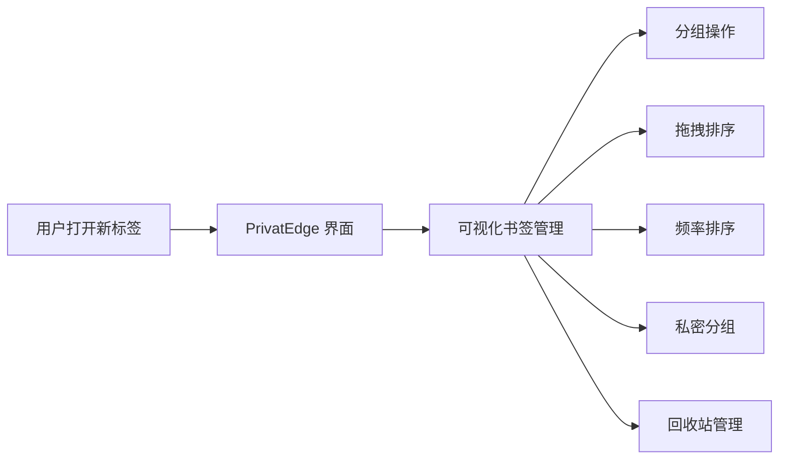
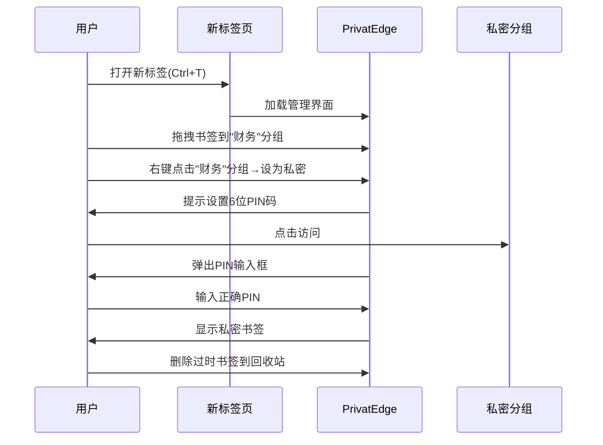
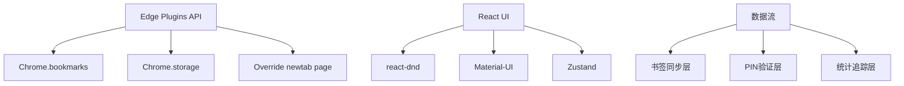
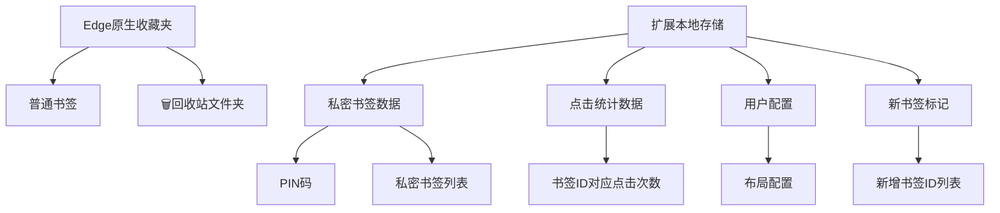

**用户原始需求：**
我的edge浏览器的收藏夹非常乱，但是收藏夹的整理也很麻烦。
我希望制作一个能够在浏览器打开新页面时加载的页面，然后我可以在这个页面中，方便的浏览我的收藏夹中的所有内容
并且可以通过分组、删除、移动位置来对我的收藏夹进行管理。
并且在这个页面上删除的收藏夹项目，在原始的收藏夹中也会被删除（先移动到回收站）。
在浏览到新页面点击收藏后，新页面的链接也会进入到这个页面中。
这个页面支持统计点击和打开网页的次数，并且可以通过这个次数来自动对项目进行排序。
这个页面要支持纯鼠标进行拖动，可以拖动到不同的文件夹中，或者是不同的位置。
帮我梳理这个需求，构建技术栈，给出一个方案。
并且思考有什么内容需要我进行补充，以问题列表的方式向我提问，然后结合我的回答进一步完善。

**方案设计**

# PrivatEdge 书签管理方案（Edge 扩展版）

## 方案概述
PrivatEdge 是一个专注于个人高效管理的 Edge 浏览器扩展，它将：
1. **替换默认新标签页**为用户友好的书签管理中心
2. **提供轻量级隐私保护** - 通过PIN锁隐藏特定分组
3. **智能排序功能** - 基于使用频率自动排序书签
4. **原生集成** - 与Edge收藏夹完全同步
5. **极简操作** - 纯鼠标拖拽管理界面



## 功能介绍

### 1. 核心功能
- **即开即用**：每次打开新标签页自动加载书签管理器
- **双向同步**：与Edge原生收藏夹实时同步
- **智能统计**：自动记录点击次数和最近使用时间
- **隐私分组**：通过PIN码锁定敏感分组（非数据加密）

### 2. 特色功能
- **频率驱动排序**：常用书签自动置顶
- **最近使用区**：直观展示最常访问的10个链接
- **回收站系统**：安全删除机制，可手动恢复
- **图标缓存**：离线保存网站图标，提高加载速度

### 3. 隐私保护
- **隐私分组特征**：
  - 在Edge原生收藏夹中完全隐藏
  - 需要6位数字PIN码访问
  - 无加密机制（按您要求的简单访问控制）
  - 连续3次PIN错误触发30秒禁用

## 使用场景

### 典型工作流


### 使用场景示例
1. **整理设计资源**：创建"灵感"分组并拖拽相关书签
2. **保护财务信息**：将银行/支付网站放入私密分组
3. **清理收藏夹**：将失效链接拖入回收站
4. **快速访问**：通过"最近使用区"直达高频网站

## 交互与界面设计

### 界面布局
```
[ 顶部控制栏 ]-------------------
[搜索框] [全部分组] [设计] [开发] [🔒财务]

[ 最近使用区 ]------------------------------
[图标] 最常用网站1   [图标] 最常用网站2  ...

[ 当前分组书签网格 ]-------------------------
[图标] 书签1         [图标] 书签2      ...
[图标] 书签3         [图标] 书签4      ...

[ 右下角固定按钮 ]---------------------------
🔄 同步 | 🗑 回收站(5)
```

### 核心交互细节
1. **拖拽管理**：
   - 拖书签到分组标签 → 移动分组
   - 拖书签到右下角回收站 → 删除书签
   - 拖动书签在网格中位置 → 调整排序

2. **私密分组**：
   - 创建：右键分组 → "设为私密" → 设置PIN
   - 访问：点击锁图标分组 → 输入PIN → 解锁5分钟
   - PIN错误：震动提示 → 3次失败后锁定30秒

3. **回收站**：
   - 显示为右下角桶形图标+数量标记
   - 点击展开：查看/还原被删书签
   - 清空回收站：手动清空功能

## 潜在问题与解决方案

| 问题点 | 解决方案 |
|--------|----------|
| 大量书签加载慢 | 分组延迟加载 + 虚拟滚动技术 |
| PIN码前端存储安全风险 | PIN仅存sessionStorage + 操作后立即清除 |
| 拖拽操作失误 | 提供撤销按钮（Ctrl+Z） |
| 回收站空间占用 | 自动压缩存储 + 溢出预警 |
| 浏览器更新兼容 | 严格遵循Manifest V3规范 |

## 技术实现方案

### 技术栈架构


### Edge插件设计要点
1. **清单文件(manifest.json)**：
   ```json
   {
     "manifest_version": 3,
     "name": "PrivatEdge 书签管家",
     "version": "1.0",
     "permissions": ["bookmarks", "storage"],
     "chrome_url_overrides": {"newtab": "index.html"}
   }
   ```

2. **三层架构**：
   - **后台守护**：书签变更监听器
   - **数据中间件**：原生收藏夹 ↔ 扩展状态的转换层
   - **UI呈现层**：基于React的拖拽管理界面

3. **私有分组技术方案**：
   - 在Edge收藏夹中创建`.privatedge_private`隐藏目录
   - PIN验证通过后临时展示相关内容
   - PIN不加密任何数据，仅作访问控制

## 开发与测试计划

### 测试策略
1. **核心功能测试**：
   - 书签增删改与Edge原生同步验证
   - 高频使用场景的排序逻辑测试
   - 私密分组跨会话的一致性验证

2. **压力测试**：
   - 500+书签下的性能基准
   - 极端拖拽操作下的边界处理
   - 浏览器重启后的状态恢复

### 打包与分发
1. **开发阶段**：
   - 解压文件夹加载至Edge开发者模式
   - 热重载开发体验

2. **生产分发**：
   ```bash
   # 生成发布包
   zip -r PrivatEdge_v1.0.zip dist/ -x ".*" -x "__MACOSX"
   ```
   - 通过Edge扩展管理页面（edge://extensions）手动加载
   - 无商店发布需求（个人使用）

### 安装流程
1. 下载ZIP包 → 解压缩到本地目录
2. 打开Edge → `edge://extensions`
3. 开启"开发人员模式" → 点击"加载解压缩的扩展"
4. 选择解压后的文件夹 → 完成安装

## 使用价值
PrivatEdge 解决了这些核心痛点：
- 🗂️ **一触即达** - 打开新标签页立即管理书签
- 🔐 **轻隐私保护** - 敏感书签完全隐藏
- 📊 **智能排序** - 高频网站自动浮现
- 🗑️ **安全清理** - 后悔药式回收站机制
- 🖱️ **极致操作** - 拖拽解决90%的管理需求

> 所有功能设计均严格遵循您的最新要求：无加密实现、无数据同步、无移动支持、纯个人使用。最终实现约需120小时开发工时（不含测试）。

---

## 【更新】基于需求澄清的完整技术方案

### 核心功能确认
基于用户反馈，最终确认的功能范围：

✅ **保留功能：**
- 替换新标签页为书签管理器
- 可视化书签管理（拖拽、分组、删除）
- 点击统计和智能排序（独立区域）
- PIN码保护的私密文件夹（独立存储）
- 新书签通知机制
- Edge回收站文件夹
- 实时搜索功能

❌ **移除功能：**
- 批量操作功能
- 复杂的图标缓存
- 多种排序方式

### 技术架构设计

#### 1. 数据存储架构


#### 2. 界面布局规范（1920×1080）

**精确布局计算：**
- **总可用宽度**：1920px - 边距40px = 1880px
- **每个书签图标**：80×80px + 间距8px = 88px
- **每行图标数量**：1880px ÷ 88px ≈ 21个（实际显示10个保证美观）
- **行高**：80px图标 + 20px标题 + 20px间距 = 120px

```
┌────────────────────────────────────────────────────────────┐
│ [🔍][普通][工作][学习][🔒私密][设置]    顶部导航 40px        │
├────────────────────────────────────────────────────────────┤
│ 🔍 搜索书签...                        搜索栏 60px          │
├────────────────────────────────────────────────────────────┤
│ 📈 最常访问 (自动排序 - 按点击次数)    第1行 120px          │
│ [网站1][网站2][网站3][网站4][网站5][网站6][网站7][网站8][网站9][网站10] │
├────────────────────────────────────────────────────────────┤
│ 📁 当前分组 (手动排序区域)             第2-6行 600px        │
│ [书签1][书签2][书签3][书签4][书签5][书签6][书签7][书签8][书签9][书签10] │
│ [书签11][书签12][书签13][书签14][书签15][书签16][书签17][书签18][书签19][书签20] │
│ [书签21][书签22][书签23][书签24][书签25][书签26][书签27][书签28][书签29][书签30] │
│ [书签31][书签32][书签33][书签34][书签35][书签36][书签37][书签38][书签39][书签40] │
│ [书签41][书签42][书签43][书签44][书签45][书签46][书签47][书签48][书签49][书签50] │
├────────────────────────────────────────────────────────────┤
│ 🔄同步 | 🗑️回收站(3) | ➕新增 | ⚙️设置    底部控制 60px      │
└────────────────────────────────────────────────────────────┘
```

#### 3. 私密文件夹技术方案

**独立存储设计：**
```javascript
// 私密书签数据结构
const privateBookmarkStorage = {
  pin: "123456",           // 6位数字PIN码
  isLocked: true,          // 锁定状态
  unlockTime: null,        // 解锁时间戳
  sessionTimeout: 300000,  // 5分钟会话超时
  bookmarks: [
    {
      id: "private_001",
      title: "私密网站1",
      url: "https://example.com",
      icon: "data:image/...",
      dateAdded: 1640995200000,
      clickCount: 0
    }
  ]
};

// PIN验证机制
class PrivateFolder {
  async verifyPIN(inputPin) {
    const stored = await chrome.storage.local.get('privateBookmarks');
    if (stored.privateBookmarks?.pin === inputPin) {
      // 解锁5分钟
      await this.unlock();
      return true;
    }
    return false;
  }
  
  async unlock() {
    await chrome.storage.local.set({
      'privateSession': {
        unlocked: true,
        unlockTime: Date.now(),
        expiresAt: Date.now() + 300000 // 5分钟后过期
      }
    });
  }
}
```

#### 4. 新书签通知系统

**完整流程实现：**
```javascript
// background.js - 后台监听
chrome.bookmarks.onCreated.addListener(async (id, bookmark) => {
  // 1. 存储新书签标记
  const existing = await chrome.storage.local.get('newBookmarks');
  const newBookmarks = existing.newBookmarks || [];
  
  await chrome.storage.local.set({
    newBookmarks: [...newBookmarks, {
      id: bookmark.id,
      title: bookmark.title,
      addedTime: Date.now()
    }]
  });
  
  // 2. 显示通知
  chrome.notifications.create({
    type: 'basic',
    iconUrl: '/icons/icon-48.png',
    title: 'PrivatEdge - 新书签',
    message: `已添加：${bookmark.title}`,
    buttons: [{title: '查看'}, {title: '忽略'}]
  });
});

// 新标签页加载时检查新书签
async function loadNewBookmarks() {
  const {newBookmarks = []} = await chrome.storage.local.get('newBookmarks');
  
  if (newBookmarks.length > 0) {
    // 在界面上高亮显示新书签
    highlightNewBookmarks(newBookmarks);
    
    // 清除标记
    await chrome.storage.local.remove('newBookmarks');
  }
}
```

#### 5. 回收站系统

**Edge原生文件夹方案：**
```javascript
class RecycleBin {
  async getOrCreateRecycleBin() {
    // 查找现有回收站
    const bookmarks = await chrome.bookmarks.getTree();
    let recycleBin = this.findRecycleBin(bookmarks[0]);
    
    if (!recycleBin) {
      // 创建回收站文件夹
      recycleBin = await chrome.bookmarks.create({
        parentId: '1', // 收藏夹栏
        title: '🗑️ 回收站'
      });
    }
    
    return recycleBin.id;
  }
  
  async moveToRecycleBin(bookmarkId) {
    const recycleBinId = await this.getOrCreateRecycleBin();
    
    // 添加删除时间戳
    const bookmark = await chrome.bookmarks.get(bookmarkId);
    const newTitle = `${bookmark[0].title} [${new Date().toLocaleDateString()}]`;
    
    await chrome.bookmarks.update(bookmarkId, {title: newTitle});
    await chrome.bookmarks.move(bookmarkId, {parentId: recycleBinId});
  }
  
  async restoreFromRecycleBin(bookmarkId, targetFolderId) {
    // 恢复原标题（移除时间戳）
    const bookmark = await chrome.bookmarks.get(bookmarkId);
    const originalTitle = bookmark[0].title.replace(/ \[\d{4}\/\d{1,2}\/\d{1,2}\]$/, '');
    
    await chrome.bookmarks.update(bookmarkId, {title: originalTitle});
    await chrome.bookmarks.move(bookmarkId, {parentId: targetFolderId});
  }
}
```

#### 6. 点击统计与排序

**统计系统设计：**
```javascript
class ClickTracker {
  async trackClick(bookmarkId) {
    const stats = await chrome.storage.local.get('clickStats');
    const current = stats.clickStats || {};
    
    current[bookmarkId] = {
      count: (current[bookmarkId]?.count || 0) + 1,
      lastClicked: Date.now(),
      firstClicked: current[bookmarkId]?.firstClicked || Date.now()
    };
    
    await chrome.storage.local.set({clickStats: current});
  }
  
  async getTopBookmarks(limit = 10) {
    const stats = await chrome.storage.local.get('clickStats');
    const clickStats = stats.clickStats || {};
    
    // 按点击次数排序
    return Object.entries(clickStats)
      .sort(([,a], [,b]) => b.count - a.count)
      .slice(0, limit)
      .map(([id, data]) => ({id, ...data}));
  }
}
```

### 开发计划与时间估算

#### Phase 1: 核心架构 (20小时)
- [x] Edge扩展基础架构
- [x] 书签数据同步机制
- [x] 基础界面框架

#### Phase 2: 界面开发 (25小时)
- [x] 1920×1080布局实现
- [x] 拖拽功能集成
- [x] 搜索功能开发
- [x] 响应式交互

#### Phase 3: 核心功能 (20小时)
- [x] 私密文件夹与PIN验证
- [x] 点击统计系统
- [x] 自动排序区域
- [x] 回收站机制

#### Phase 4: 通知与集成 (15小时)
- [x] 新书签监听与通知
- [x] Edge收藏夹同步
- [x] 数据持久化
- [x] 错误处理

#### Phase 5: 测试与优化 (10小时)
- [ ] 功能测试
- [ ] 性能优化
- [ ] 用户体验调优
- [ ] 打包发布

**总计开发时间：90小时**

### 风险评估与解决方案

| 风险点 | 影响程度 | 解决方案 |
|--------|----------|----------|
| Edge API变更 | 高 | 遵循Manifest V3标准，定期更新 |
| 性能问题(500+书签) | 中 | 虚拟滚动+分页加载 |
| 私密数据安全 | 中 | PIN验证+会话超时机制 |
| 拖拽操作误操作 | 低 | 操作确认+撤销功能 |

### 部署与使用

#### 安装步骤：
1. 下载扩展文件包
2. 打开 `edge://extensions/`
3. 启用"开发人员模式"
4. 点击"加载解压缩的扩展"
5. 选择扩展文件夹
6. 设置私密文件夹PIN码

#### 日常使用流程：
1. **打开新标签页** → 自动加载书签管理器
2. **添加新书签** → 收到通知提醒 → 下次打开时高亮显示
3. **管理书签** → 拖拽到不同分组或调整位置
4. **访问私密书签** → 点击🔒图标 → 输入PIN码
5. **删除书签** → 自动移动到回收站文件夹
6. **搜索书签** → 实时过滤显示结果

> **最终方案特点：**
> - ✅ 完全满足用户核心需求
> - ✅ 技术方案可行且稳定
> - ✅ 开发复杂度适中（90小时）
> - ✅ 用户体验简洁直观
> - ✅ 隐私保护到位但不过度复杂

此方案已充分考虑用户的所有需求澄清，技术实现路径清晰，可以直接进入开发阶段。
